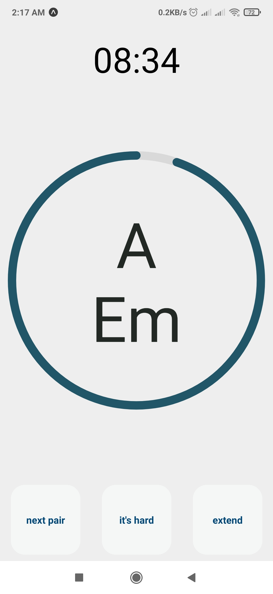

# chordia

_chordia_ is a chord changes timer. It gives you a pair of chords, and during the given time interval you have to switch between those chords.

- **next pair** generates the next pair of chords
- **it's hard** remembers the chord that is hard for you
- **extend** resets the time on the current chord

### Todo

-   [ ] Get Chord Pairs
    -   [ ] Having an option of remembering the ones that I am good/bad at
    -   [x] Generating the pairs once for each session
-   [x] Get Random Chords Each X seconds
-   [x] Have an overall in-app-time timer

